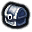
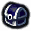

# Functions

* `ns.GetIconPath(name)`
  * todo
* `ns.GetIconLink(name, size, offsetX, offsetY)`
  * todo
* `ns.GetGlowPath(name)`
  * todo

# Icons

A list of icons

## Chests

|                   | Icon                                                       | name             |
|-------------------|------------------------------------------------------------|------------------|
| Chest Black       |            | `'chest_bk'`     |
| Chest Blue        |             | `'chest_bl'`     |
| Chest Brown       |            | `'chest_bn'`     |
| Chest Green       |            | `'chest_gn'`     |
| Chest Gray        |             | `'chest_gy'`     |
| Chest Lime        |             | `'chest_lm'`     |
| Chest Navy        |             | `'chest_nv'`     |
| Chest Pink        |             | `'chest_pk'`     |
| Chest Purple      |           | `'chest_pp'`     |
| Chest Red         |              | `'chest_rd'`     |
| Chest Teal        |             | `'chest_tl'`     |
| Chest Yellow      |           | `'chest_yw'`     |
| Star Chest Blue   |    | `'star_chest_b'` |
| Star Chest Gray   |    | `'star_chest_g'` |
| Star Chest Pink   |    | `'star_chest_p'` |
| Star Chest Yellow |  | `'star_chest_y'` |

## Crystals

|                | Icon                                                 | name          |
|----------------|------------------------------------------------------|---------------|
| Crystal Blue   |    | `'crystal_b'` |
| Crystal Orange |  | `'crystal_o'` |
| Crystal Purple |  | `'crystal_p'` |

## Flight Points

|                     | Icon                                                           | name               |
|---------------------|----------------------------------------------------------------|--------------------|
| Flight Point Gray   |    | `'flight_point_g'` |
| Flight Point Yellow |  | `'flight_point_y'` |

## Horseshoes

|                  | Icon                                                     | name            |
|------------------|----------------------------------------------------------|-----------------|
| Horseshoe Black  |   | `'horseshoe_b'` |
| Horseshoe Gray   |    | `'horseshoe_g'` |
| Horseshoe Orange |  | `'horseshoe_o'` |

## Pet Battle Paws

|            | Icon                                         | name      |
|------------|----------------------------------------------|-----------|
| Paw Green  |   | `'paw_g'` |
| Paw Yellow |  | `'paw_y'` |

## Pegs

|            | Icon                                          | name       |
|------------|-----------------------------------------------|------------|
| Peg Blue   |    | `'peg_bl'` |
| Peg Black  |   | `'peg_bk'` |
| Peg Green  |   | `'peg_gn'` |
| Peg Red    |     | `'peg_rd'` |
| Peg Yellow |  | `'peg_yw'` |

## Portals

|               | Icon                                                | name          |
|---------------|-----------------------------------------------------|---------------|
| Portal Blue   |    | `'portal_bl'` |
| Portal Gray   |    | `'portal_gy'` |
| Portal Green  |   | `'portal_gn'` |
| Portal Purple |  | `'portal_pp'` |
| Portal Red    |     | `'portal_rd'` |

## Quests

|                        | Icon                                                        | name            |
|------------------------|-------------------------------------------------------------|-----------------|
| Quest available Blue   |    | `'quest_ab'`    |
| Quest available Green  |   | `'quest_ag'`    |
| Quest available Orange |  | `'quest_ao'`    |
| Quest available Yellow |  | `'quest_ay'`    |
| world_quest            |          | `'world_quest'` |

## Skulls

|                  | Icon                                                      | name             |
|------------------|-----------------------------------------------------------|------------------|
| Skull Blue       |             | `'skull_b'`      |
| Skull White      |            | `'skull_w'`      |
| Star Skull Blue  |   | `'star_skull_b'` |
| Star Skull White |  | `'star_skull_w'` |

## Miscellaneous Icons

|                   | Icon                                                        | name                |
|-------------------|-------------------------------------------------------------|---------------------|
| Alliance          |                | `'alliance'`        |
| Horde             |                      | `'horde'`           |
| Achievement       |          | `'achievement'`     |
| Door Down         |              | `'door_down'`       |
| Envelope          |                | `'envelope'`        |
| Left Mouse Button |            | `'left_mouse'`      |
| Scroll            |                    | `'scroll'`          |
| War Mode Flags    |    | `'war_mode_flags'`  |
| War Mode Swords   |  | `'war_mode_swords'` |
| Checkmark Blue    |              | `'check_bl'`        |
| Checkmark Green   |             | `'check_gn'`        |
| Checkmark Gray    |              | `'check_gy'`        |
| Checkmark Yellow  |            | `'check_yw'`        |
